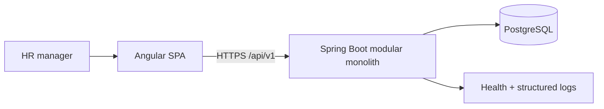

# Architecture

The system is a modular monolith: an Angular SPA calls a versioned Spring Boot REST API, which owns transactions and persists to PostgreSQL. Modules are grouped by business capability (`employee`, `salary`, `analytics`, `imports`, `auth`, `shared`) so their contracts remain understandable and extractable without paying distributed-system costs now.

Key decisions: effective-dated salary records retain history; exact decimals protect money calculations; deterministic FX rates make cross-country reports reproducible; explicit aggregate queries avoid loading 10,000 employees into memory; deactivation protects history.

